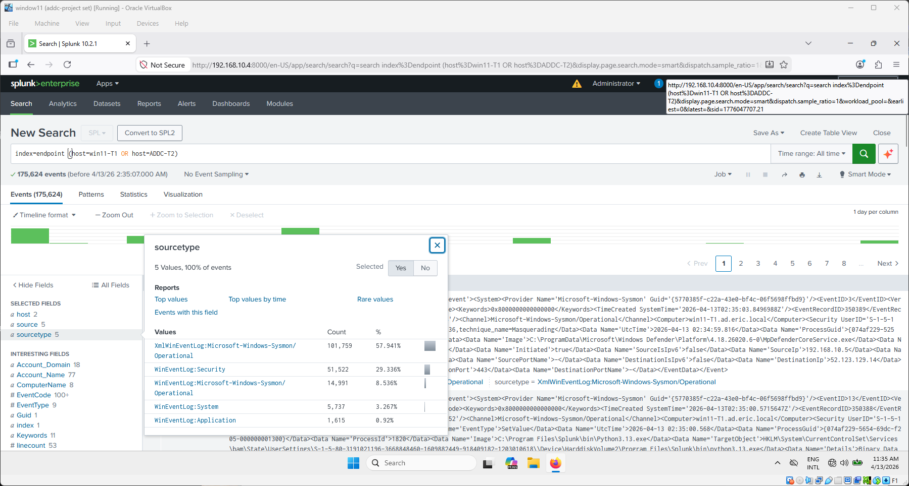
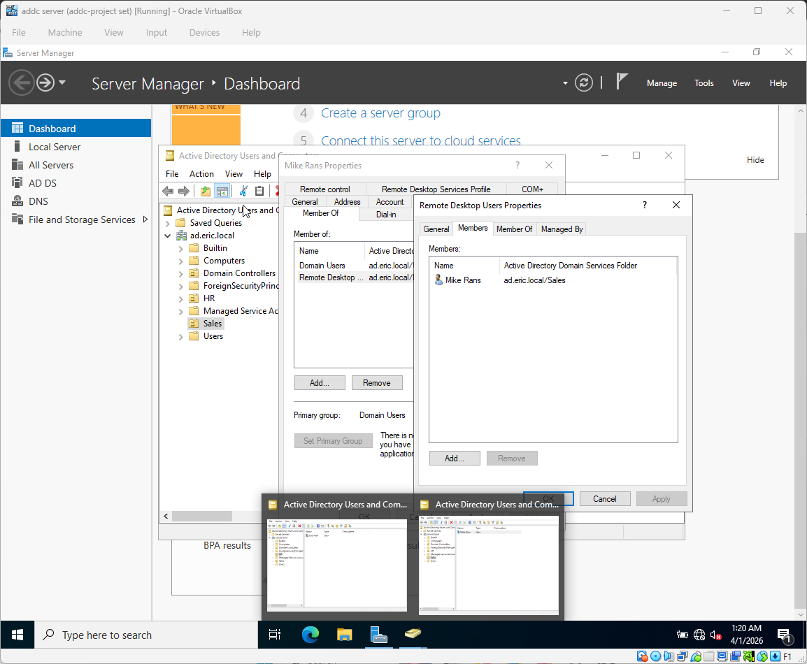
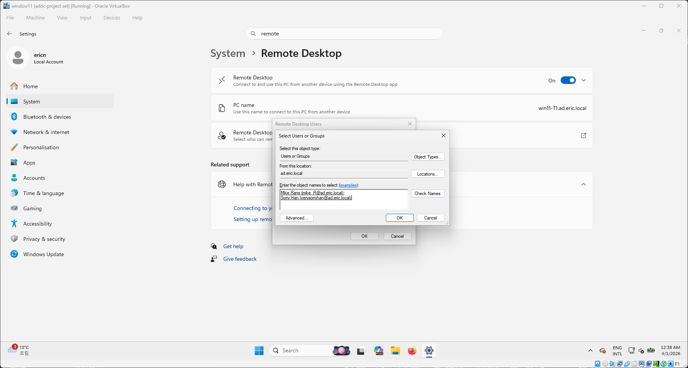
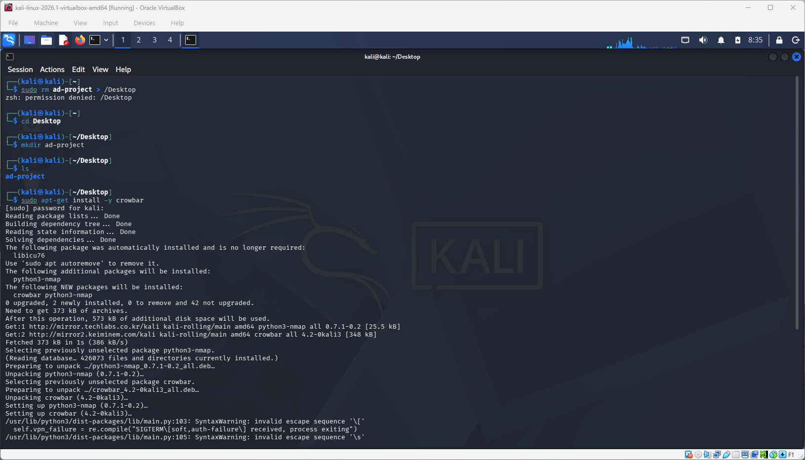
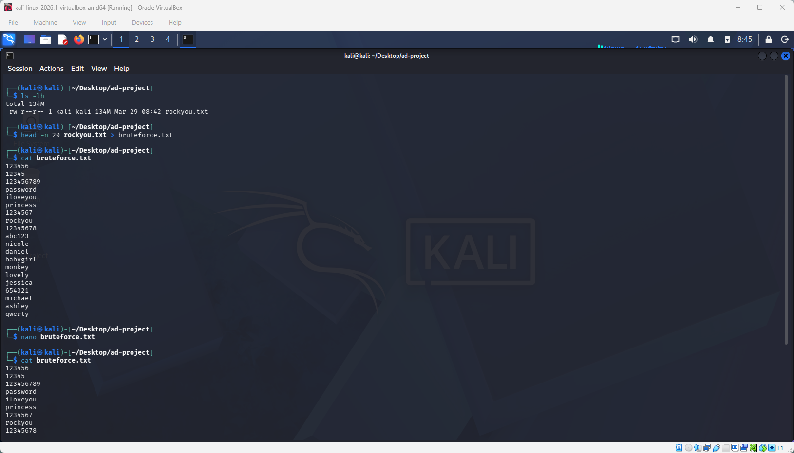
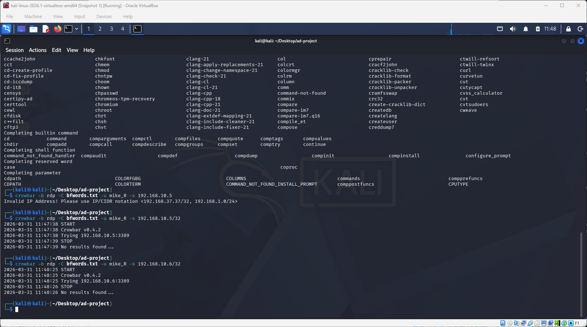
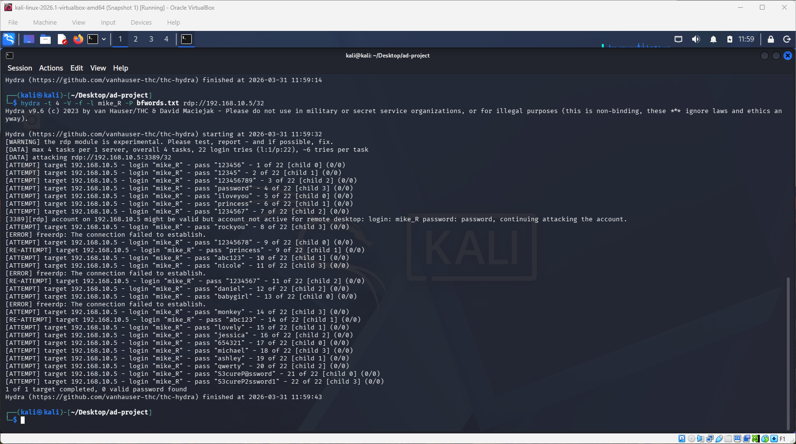
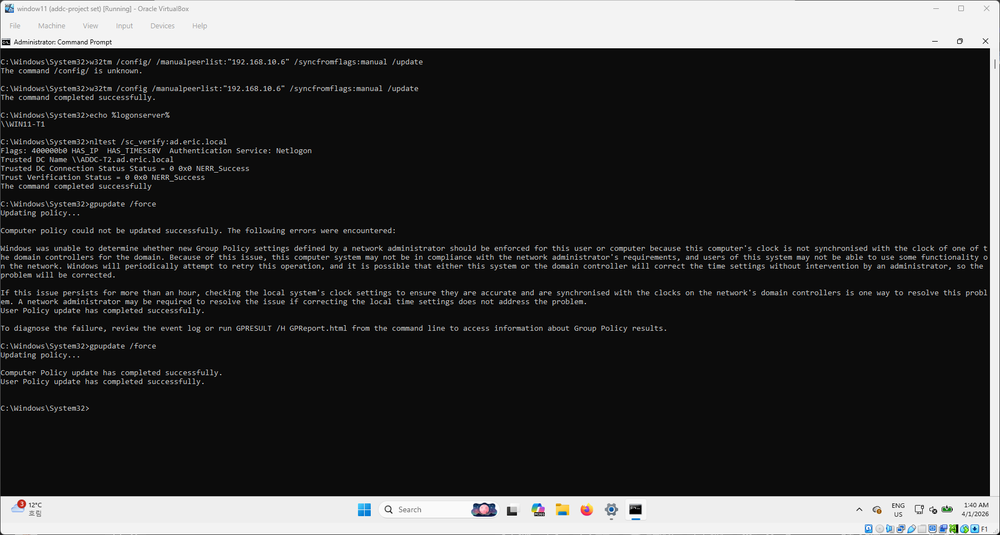

# ADDC-Attack-Detection-Simulation
# Active Directory Attack Simulation & SOC Detection Lab

> **Part 2 of the Active Directory Project series.**
> For environment setup (VirtualBox, Ubuntu Splunk, Windows Server 2022 DC, Sysmon, Universal Forwarder), see 👉 [ADDC-Soc-Simulator-lab (Part 1)](https://github.com/ericnam-png/ADDC-Soc-Simulator-lab)

This project simulates a realistic Active Directory attack chain — from RDP brute-force attempts through domain account targeting — and demonstrates how each stage is detected, investigated, and correlated in Splunk. Atomic Red Team is used to simulate additional MITRE ATT&CK techniques and validate detection coverage.

---

## Architecture

| Role | Machine | IP Address |
|---|---|---|
| SIEM (Splunk Server) | Ubuntu 24.04 LTS | 192.168.10.4 |
| Target 1 (Endpoint) | Windows 11 Pro (`win11-T1`) | 192.168.10.5 |
| Target 2 (Domain Controller) | Windows Server 2022 (`ADDC-T2`) | 192.168.10.6 |
| Attacker | Kali Linux | 192.168.10.7 |

- Domain: `ad.eric.local`
- Network: `192.168.10.0/24`
- All VMs on VirtualBox NAT network
- Sysmon + Splunk Universal Forwarder running on both `win11-T1` and `ADDC-T2`
- Logs forwarded to Ubuntu Splunk server at `192.168.10.4:9997`, indexed under `endpoint`

<p>
  
  
</p>

---

## AD Users & Structure

| OU | Display Name | Logon Name | Notes |
|---|---|---|---|
| Sales | Mike Rans | `mike_R` | Target account — intentionally weak password |
| HR | Sorry Han | `verysorryhan` | Secondary domain user |

<p>
  
  
</p>

Both accounts were added to the `Remote Desktop Users` group on `win11-T1` to allow RDP access, simulating a realistic enterprise misconfiguration.


---

## Attack & Detection Workflow

### Phase 1 — Attacker Setup & Wordlist Preparation

The attacker machine (Kali Linux) was prepared with brute-force tooling and a custom password wordlist seeded with the target account's weak password.

**Tools installed:** `crowbar`, `hydra`, `ncrack`, `crackmapexec`

```bash
# Kali: install crowbar
sudo apt-get install -y crowbar

# Extract rockyou.txt wordlist
sudo gunzip /usr/share/wordlists/rockyou.txt.gz
cp /usr/share/wordlists/rockyou.txt ~/Desktop/ad-project/

# Create a focused brute-force list (top 20 from rockyou + custom entries)
head -n 20 rockyou.txt > bfwords.txt
# Then manually add target-specific passwords via nano:
#   S3cureP@ssword
#   S3cureP2ssword1
```
<p>
  
  
</p>

---

### Phase 2 — RDP Brute-Force Attempts

Multiple tools were used to attempt brute-force authentication against the Windows 11 target over RDP (port 3389).

**Crowbar:**
```bash
# Note: requires CIDR notation
crowbar -b rdp -C bfwords.txt -u mike_R -s 192.168.10.5/32
```

**Hydra:**
```bash
hydra -t 4 -V -f -l mike_R -P bfwords.txt rdp://192.168.10.5/32
```

**ncrack:**
```bash
ncrack -vv -T 4 --user mike_R -P bfwords.txt rdp://192.168.10.5
```

**CrackMapExec (SMB):**
```bash
crackmapexec smb 192.168.10.5 -u mike_R -p S3cureP@ssword
```
<p>
  
  
</p>

> **Real-world note:** All automated RDP brute-force tools (Crowbar, Hydra, ncrack) failed to establish a session. This is realistic — NLA (Network Level Authentication) and Kerberos time-sync requirements block most RDP brute-force tools in domain environments. The failures were themselves valuable: they generated **Event ID 4625** (failed logon) records in Splunk, which is exactly what a SOC analyst would investigate.

**Root cause identified:** `gpupdate /force` was failing on `win11-T1` due to a clock skew between the endpoint and the domain controller. Kerberos requires clocks to be within 5 minutes of each other.

**Time sync fix (on win11-T1, run as Administrator):**
```cmd
:: Confirm DC reachability
ping ad.eric.local

:: Configure w32tm to sync from DC
w32tm /config /manualpeerlist:"192.168.10.6" /syncfromflags:manual /update

:: Restart time service
net stop w32time
net start w32time
w32tm /resync

:: Verify trust
nltest /sc_verify:ad.eric.local

:: Force Group Policy update
gpupdate /force
```
Once time sync was restored, `gpupdate /force` completed successfully and domain authentication functioned correctly.

<p>
  
</p>

---

### Phase 3 — Successful RDP Access

With the correct credentials confirmed, a manual RDP session was established from Kali using `xfreerdp`:

```bash
xfreerdp /u:mike_R /p:S3cureP@ssword /v:192.168.10.5
```

This successfully opened a remote desktop session as `mike_R` on `win11-T1`, generating the key authentication event in Splunk.

**Detection — Successful Logon (Event ID 4624):**
```spl
index=endpoint host="win11-T1" EventCode=4624
```
- 134 total Event ID 4624 records captured across both `win11-T1` and `ADDC-T2`
- Key fields visible: `Account_Name=mike_R`, `Account_Domain=AD`, `Source_Network_Address=192.168.10.7`, `Logon_Type=10` (RemoteInteractive)


**Detection — Failed Logon Attempts (Event ID 4625):**
```spl
index=endpoint host="win11-T1" EventCode=4625
```
- Multiple 4625 events captured from the brute-force tool runs
- Useful for correlating failed → successful logon sequences


**Splunk correlation query — brute-force pattern:**
```spl
index=endpoint EventCode=4625 Account_Name=mike_R
| bucket _time span=5m
| stats count by _time, Account_Name, Source_Network_Address
| where count >= 5
```

---

### Phase 4 — Atomic Red Team: MITRE ATT&CK Technique Simulation

Atomic Red Team was installed on `win11-T1` to simulate additional MITRE ATT&CK techniques and generate detectable telemetry in Splunk.

**Installation (PowerShell as Administrator on win11-T1):**
```powershell
# Bypass execution policy
Set-ExecutionPolicy Bypass CurrentUser

# Install Atomic Red Team
IEX (IWR 'https://raw.githubusercontent.com/redcanaryco/invoke-atomicredteam/master/install-atomicredteam.ps1' -UseBasicParsing)
Install-AtomicRedTeam -getAtomics

# Confirm atomics folder
# C:\AtomicRedTeam\atomics\ — 330 technique folders
```


> **Note:** Windows Defender real-time protection was disabled and a `C:\` folder exclusion was added before installation to allow Atomic Red Team to operate without interference.

---

#### Technique: T1136.001 — Create Local Account

Simulated creation and deletion of a local Windows account to test account lifecycle detection.

```powershell
Invoke-AtomicTest T1136.001
```

**What happened:**
- Tests 4 and 5 attempted to create a local user via `net user` and PowerShell — partially failed due to domain password policy complexity requirements
- Test 8 successfully created a new Windows admin user via `net localgroup`
- Test 9 created `NewLocalUser`, added it to the `Administrators` group, then deleted it


**Splunk detection — Account Created (Event ID 4720):**
```spl
index=endpoint NewLocalUser EventCode=4720
```
Result: Captured `NewLocalUser` account creation — `Subject: ericn (WIN11-T1)`, `New Account: NewLocalUser (WIN11-T1)`


**Splunk detection — Account Deleted (Event ID 4726):**
```spl
index=endpoint NewLocalUser EventCode=4726
```
Result: Confirmed account deletion by `ericn` — full audit trail of creation and cleanup visible in Splunk.


---

#### Technique: T1136.002 — Create Domain Account

Attempted to create a domain account via PowerShell.

```powershell
Invoke-AtomicTest T1136.002
```

**Result:** All sub-tests returned `Access is denied (Exit code: 2)` — expected, since `ericn` is a local account without Domain Admin privileges. This is a realistic and intentional outcome: it demonstrates that privilege boundaries are correctly enforced and that escalation would be required in a real attack.

---

#### Technique: T1548.002 — Bypass User Account Control

UAC bypass techniques were simulated using Atomic Red Team's T1548.002 test suite (WinPwn-based methods including DiskCleanup and DccwBypassUAC).

```powershell
Invoke-AtomicTest T1548.002
```

**Splunk detection — Sysmon Registry Event (Event ID 13):**
```spl
index=endpoint EventCode=13
```
Result: Sysmon captured registry value modifications to `HKCU\Software\Classes\mscfile\shell\open\command` — the classic UAC bypass via `eventvwr.msc` hijack.


**Splunk detection — Suspicious process via Sysmon (Event ID 1):**
```spl
index=endpoint mscfile
```
Result: 13 events captured. Sysmon Event ID 1 showed:
- `Image: C:\Windows\System32\cmd.exe`
- `ParentImage: C:\Windows\System32\WindowsPowerShell\v1.0\powershell.exe`
- `CommandLine` contained the registry key manipulation targeting `mscfile\shell\open\command`


This is the exact telemetry a SOC analyst would hunt for when investigating a UAC bypass attempt.

---

## Key Event IDs Reference

| Event ID | Source | Description | Triggered By |
|---|---|---|---|
| 4624 | Windows Security | Successful logon | xfreerdp RDP session as mike_R |
| 4625 | Windows Security | Failed logon | Crowbar / Hydra / ncrack attempts |
| 4720 | Windows Security | User account created | Atomic T1136.001 (NewLocalUser) |
| 4726 | Windows Security | User account deleted | Atomic T1136.001 cleanup |
| 4798 | Windows Security | Local group membership enumerated | Atomic T1136.001 |
| 1 | Sysmon | Process creation | UAC bypass cmd.exe spawned by PowerShell |
| 13 | Sysmon | Registry value set | UAC bypass via mscfile registry key |

---

## MITRE ATT&CK Mapping

| Technique ID | Name | Tool Used | Outcome |
|---|---|---|---|
| T1110.001 | Brute Force: Password Guessing | Crowbar, Hydra, ncrack | 4625 events generated; session blocked by NLA/Kerberos |
| T1021.001 | Remote Services: RDP | xfreerdp | Successful session; 4624 generated |
| T1136.001 | Create Account: Local Account | Atomic Red Team | NewLocalUser created and deleted; 4720/4726 captured |
| T1136.002 | Create Account: Domain Account | Atomic Red Team | Access denied; privilege boundary confirmed |
| T1548.002 | Abuse Elevation Control: Bypass UAC | Atomic Red Team | Registry manipulation detected via Sysmon EID 13 |

---

## Troubleshooting Notes

Real issues encountered and resolved during this lab:

**Clock skew breaking Group Policy and Kerberos authentication:**
`gpupdate /force` on `win11-T1` failed repeatedly with a time synchronisation error. The DC (`ADDC-T2`) and the endpoint were out of sync, causing Kerberos ticket requests to be rejected. Fixed by manually configuring `w32tm` to use the DC as its time source, restarting the Windows Time service, and re-running `gpupdate /force`. After the fix, authentication and policy application worked correctly.

**RDP brute-force tools failing against NLA-enabled targets:**
Crowbar, Hydra, and ncrack all produced `freerdp: The connection failed to establish` errors when targeting `192.168.10.5`. This is expected behaviour — NLA (Network Level Authentication) requires Kerberos pre-authentication before the RDP session is established, which breaks most brute-force tool implementations. The lab correctly reflects this real-world constraint.

**net user mike_R returning "user not found" on win11-T1:**
`mike_R` is a domain account (`AD\mike_R`), not a local account. Running `net user mike_R` without the domain prefix searches only local accounts. To query domain accounts, use `net user mike_R /domain` from a domain-joined machine or query via ADUC on the DC.

**Atomic Red Team T1136.001 tests failing on password complexity:**
Some sub-tests use simple passwords like `password` or `T3stUser` that don't meet the domain's password complexity policy (minimum length, uppercase, symbol requirements enforced via GPO). This is expected — it demonstrates that the domain policy is working as intended.

**invoke-atomictest not found after a new PowerShell session:**
The `Invoke-AtomicTest` function is loaded into the current session only. If a new PowerShell window is opened, run `Import-Module "C:\AtomicRedTeam\invoke-atomicredteam\Invoke-AtomicRedTeam.psd1"` to reload the module before running tests.

---

## Splunk Queries Used

```spl
# All endpoint events
index=endpoint

# Successful logons on win11-T1
index=endpoint host="win11-T1" EventCode=4624

# Failed logons (brute-force evidence)
index=endpoint host="win11-T1" EventCode=4625

# Brute-force pattern: 5+ failures in 5 minutes
index=endpoint EventCode=4625 Account_Name=mike_R
| bucket _time span=5m
| stats count by _time, Account_Name, Source_Network_Address
| where count >= 5

# Account lifecycle: NewLocalUser created then deleted
index=endpoint NewLocalUser

# UAC bypass via registry
index=endpoint mscfile

# Sysmon registry modification events
index=endpoint EventCode=13

# Domain Controller logon events
index=endpoint host="ADDC-T2" EventCode=4624
```

---

## What I Learned

**On the attacker side:** RDP brute-force is significantly harder against domain-joined machines than isolated workstations. NLA, Kerberos clock requirements, and SMB filtering all reduce the effectiveness of automated tooling in a real AD environment. Understanding *why* the tools fail is as valuable as seeing them succeed.

**On the defender side:** Failed logon storms (4625) are highly detectable and easy to baseline — any spike from a single source IP against a single account is a strong indicator. Successful domain logons (4624) from unexpected source IPs, especially with `Logon_Type=10` (RemoteInteractive), are worth alerting on immediately.

**On infrastructure:** Time synchronisation is not optional in Active Directory. A 5-minute clock skew breaks Kerberos, which breaks authentication, which breaks everything — Group Policy, domain joins, and tool-based attacks alike. This is a real operational issue that affects both attackers and defenders.

**On detection engineering:** Atomic Red Team is a practical way to generate known-bad telemetry and validate that your SIEM is actually capturing what it should. Running T1136.001 and seeing Event IDs 4720 and 4726 appear in Splunk within seconds confirms the detection pipeline is working end-to-end.

---

## Project Series

| Part | Repository | Focus |
|---|---|---|
| 0 | [soc-homelab-setup](https://github.com/ericnam-png/soc-homelab-setup) | Foundational SOC lab — VirtualBox, Splunk, Sysmon |
| 1 | [splunk-detection-lab](https://github.com/ericnam-png/splunk-detection-lab) | Attack simulation & detection — RCE, brute-force, malware execution |
| 2 | [ADDC-Soc-Simulator-lab (Part 1)](https://github.com/ericnam-png/ADDC-Soc-Simulator-lab) | Active Directory environment setup — 4-VM lab, domain, Splunk forwarding |
| 3 | This repo | AD attack simulation — RDP brute-force, Atomic Red Team, Sysmon detection |

---

## Legal Disclaimer

This project was conducted entirely within a self-owned, isolated VirtualBox lab environment. All machines, accounts, and credentials are fictitious and created solely for educational purposes. No external systems were targeted or accessed.

---

## References

- [MITRE ATT&CK](https://attack.mitre.org/)
- [Atomic Red Team — Red Canary](https://github.com/redcanaryco/atomic-red-team)
- [Sysmon Event ID Reference — Microsoft Docs](https://learn.microsoft.com/en-us/sysinternals/downloads/sysmon)
- [Windows Security Event IDs — Microsoft Docs](https://learn.microsoft.com/en-us/windows-server/identity/ad-ds/plan/appendix-l--events-to-monitor)
- [MyDFIR YouTube Channel](https://www.youtube.com/@MyDFIR)
